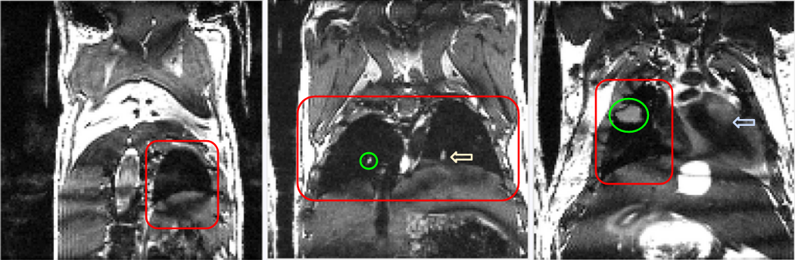
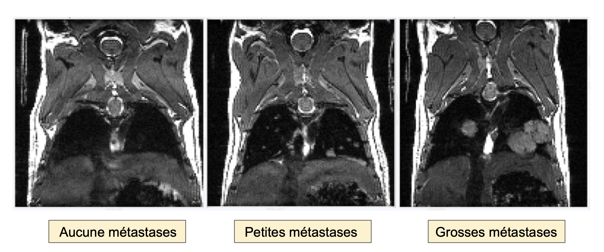

# DeepMeta
Ce projet à pour but de construire des modèles de segmentation automatique d'images IRM pour la détection des poumons et
métastases pulmonaires dans le cas du petit animal, la souris. 

Les méthodes utilisées pour ce projet sont issues du Deep Learning, leurs implémentations a été faites sous Python avec comme environnement pour les librairies les plus utilisées :

| Librairie        | Version    |
| ------------- |:-------------:| 
| numpy         | 1.17.2        | 
| pandas        | 0.24.2        |    
| scikit-image  | 0.14.2        |   
| tensorflow    | 1.14.0        |   
| keras         | 2.2.4         |   


## Données
Les données sont des images IRM 3D 128x128x128 voxels, acquises par le RMSB, représentent l'état de la maladie d'une souris 
à un instant donné. 

Les images peuvent être visualisées à l'aide du logiciel [Fiji](https://fiji.sc/) et sous différents axes (axial, coronal ou sagittal). 
Elles ont été acquises suivant le plan coronal et nous les avons traitées dans le sens coronal => meilleur visualisation des poumons.



* Rouge : Poumons.
* Vert : Métastases.
* Flèche jaune : Vaisseau.
* Flèche bleu : Coeur.

Il est possible de définir trois types d'image : 
* Souris saine : aucune métastase présente dans les poumons.
* Souris en début de maladie : plusieurs petites métastases présentes dans les poumons.
* Souris en fin de maladie : de grosses métastases matures présentes dans les poumons.



Nous disposons pour l'entrainement des réseaux de : 
* 87 images de souris = 11136 slices. 
* 27 souris annotées pour la segmentation des poumons => 2128 slices présentants des poumons. 
* 8 souris annotées pour la segmentation des métastases => 620 slices présentants des poumons et 387 d'entres elles présentent des métastases

Pour le test : 
* 3 souris annotées pour la segmentation des poumons et des métastases. 

## Projet
Le dossier du projet est disponible sur /mnt/cbib/Projet_Detection_Metastase_Souris. Pour le récuperer : 

```
scp -r adresse_connexion_serveur_ssh:/mnt/cbib/Projet_Detection_Metastase_Souris chemin_ou_le_placer/
```

L'architecture de ce dossier est la suivante : 

**Projet_Detection_Metastase_Souris**
* Antoine_Git : 
  * Ensemble des script python qui sont présentés dans la partie suivante.
  * Dossiers - Poumons / Métastases : les modèles construits, résultats de segmentation et statistique sur les résultats.
* Data : L'ensemble des données brutes acquis par le RMSB contenant deux groupes de souris iL34_1c et LacZ.
* DATA : deux dossier - Poumons et Métastases : 
  * Souris : souris.tif qui ont été annotés pour la segmentation de l'objet d'intérêt.
  * Masque : dossier contenant les masques de l'objet d'intérêt pour les souris annotées.
  * Image : ensemble des slices du dossier Souris.
  * Label : ensemble des masques associées.
  * Souris_Test : 3 souris avec respectivement des poumons sains, des petites métastases et des grosses métastases. Les masques de ces souris sont présents pour les poumons et les métastases dans les dossiers Masque.
  * Tableau_General.csv : Tableau qui résume les caractéristiques des images que j'ai jugé utile de créer que cela soit pour la segmentation des poumons ou des métastases.
* Data_contraste :
  * Blanc : dossier avec une souris ayant des contrastes très différents des images habituelles et dossier de résultats de la segmentation sur ces slices. 
  * Filtre_débruiteur : Application de filtre 3x3 max/mean/median sur les images de souris. 
  * PL33 : Image d'une souris avec encore un autre contraste prise en axiale. 
* Data_Synthétique :
  * Detect_Seg : Segmentation de souris saines par la méthode detection - segmentation avec le U-Net. 
  * Multi-Axes : Segmentation de souris saines par la multi-axiales avec le vote 1. 
  * Full_Meta : Tous les masques de métastases (uniques) - un masque par métastase. Je les avais annoté de cette manière pour appliquer la méthode des Mask-Rcnn. 
  * Nouvelles_Images : Images synthétiques construites à partir des poumons segmentés dans Detect_Seg et des métastases de Full_Meta. 
* Notebook : Ces notebooks sont présents pour une meilleure compréhension des scripts. 
  * Amélioration_Poumon : Modèle de segmentation élaborée suite à l'étude de la segmentation des poumons (pour améliorer la segmentation des souris avec de grosses métastases). 
  * CNN-LSTM : Modèle de segmentation "3D" où l'on considère l'ensemble des slices d'une souris comme une vidéo avec de la temporalité. 
  * Creation_donnée : Démarche utilisée pour construire des données synthétiques.
  * Segmentation_Metastase_3 : Démarche finale effectuée pour construire un modèle de segmentation des métastases (pas présent sur les scripts).
  * Stats_Segmentation : Première étude statistques sur les résultats de segmentation des poumons et des métastases. 


## Scripts 

* main.py
* model.py : ensemble des réseaux deep / méthodes de segmentation d'images que j'ai construit. 
* utils.py : fonctions utiles à appeler lors de la construction des différents scripts. 
* data.py : fonction pour construire les jeux de données à partir des dossiers de data et tableau csv (2D ou 3D). 
* creative_meta.py : script pour construire des données synthétiques (attention, si ce script est lancé, les données déjà créées seront supprimées et remplacées). 
* train_model_poum.py : entrainement des réseaux pour la segmentation des poumons. 
* train_model_meta.py : entrainement des réseaux pour la segmentation des métastases. 
* Cnn-Lstm.py : Evaluation de la méthode des k-Unet pour différents times (avec ou sans transfer learning) basée sur le small U-Net. 
* weighted.py : entrainement des réseaux avec modification des poids. 
* stats_seg_poum_meta.py : script utilisé pour effectuer les premières études statistiques.
* qualite.py : script pour évaluer la qualité des modèles et pour les comparer. 
* Validation_croisee.py : validation croisée pour optimiser le batch_size. 
* visualize.py : script pour visualiser les features map en sortie de niveaux de convolutions. 
* filtre_debruiteur.py : script pour construire le dossier Filtre_débruiteur (je n'ai jamais utilisé ces données).
* modif_jeu_data.py : exemple de script pour illuster la manière dont j'ai construit les jeux de données et les tableaux csv. 

### Avec console Python

J'ai construits l'ensemble de mes scripts avec la console python sur Pycharm ou Jupyter. 

Pour utiliser les scripts sur Pycharm, il suffit de spécifier le path (commenter) dans le main.py : 
```
ROOT_DIR = os.path.abspath("le_chemin_d'acces_en_entier/Projet_Detection_Metastase_Souris/") 
```

### Avec terminal
Pour lancer les script, il faut se placer dans le dossier Projet_Detection_Metastase_Souris puis lancer le script désiré : 
```
cd le_chemin_d'acces/Projet_Detection_Metastase_Souris
```
```
python main.py
```


### Résultats de segmentations


### Idée pour la suite 

* Validation croisée sur la segmentation des poumons et métastases. Par exemple considérer l'ensemble des souris annotées pour la segmentation des poumons (train et test, c'est à dire les 30 souris) et découper aléatoirement en train/test (26/4) par exemple, répéter 10 fois cette méthode, afin d'avoir des résultats robustes (pour comparer les modèles et avoir un meilleur appercu de leur qualité). 

* Annoter des souris pour la segmentation des métastases afin de pouvoir utiliser les méthodes 3D (k-Unet). 

* Optimiser le seuil en fin de U-Net (ici j'utilise 0.5 pour classifier) et pourquoi pas considérer un seuil d'aire minimale pour la segmentation des poumons pour enlever des faux positifs. 

* Construire une courbe d'apprentissage afin d'illuster la pertinence d'annoter des images sur la qualité de la segmentation. Par exemple un graphe avec en absisse les souris de 1 à 27, en ordonnée la moyenne de l'IoU sur l'ensemble des slices, et ce pour les 3 souris test. 
